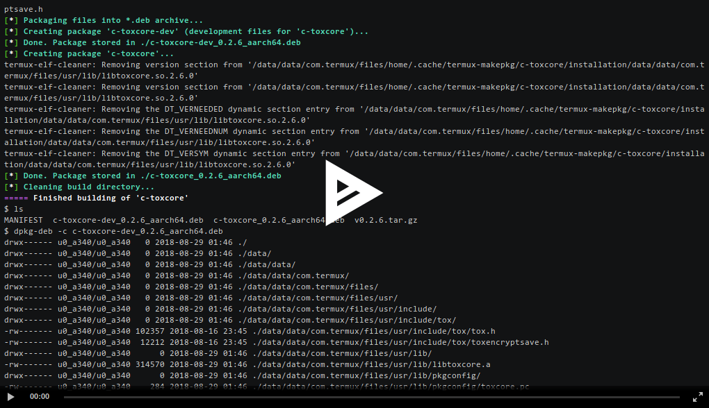

# Termux package builder

This is a very good tool for building \*.deb packages for [Termux](https://termux.com) on your
Android device. It is similar to [build-package.sh](https://github.com/xeffyr/termux-packages/blob/master/build-package.sh)
script from [termux-packages](https://github.com/termux/termux-packages) or `makepkg`
tool from [Arch Linux](https://www.archlinux.org/).

## How it works

Script `termux-makepkg` searches file 'MANIFEST' in current directory and executes steps
defined in it. This file is a just a Bash script and usually it looks like shown here:
``` .bash
#!/bin/sh
PACKAGE_MAINTAINER="Leonid Plyushch <leonid.plyushch@gmail.com> @xeffyr"

PACKAGE_NAME="bc"
PACKAGE_DESCRIPTION="Arbitrary precision numeric processing language"
PACKAGE_HOMEPAGE="https://www.gnu.org/software/bc/"
PACKAGE_VERSION="1.07.1"
PACKAGE_DEPENDS="readline"
PACKAGE_BUILD_DEPENDS="ed, flex, readline-dev, texinfo"

PACKAGE_EXTRA_CONFIGURE_ARGS="
--infodir=${TERMUX_PREFIX}/share/info
--mandir=${TERMUX_PREFIX}/share/man
--with-readline
"

PACKAGE_SOURCES=("https://mirrors.kernel.org/gnu/bc/bc-${PACKAGE_VERSION}.tar.gz")
PACKAGE_SOURCES_SHA256=('62adfca89b0a1c0164c2cdca59ca210c1d44c3ffc46daf9931cf4942664cb02a')


post_package() {
    rm -f "${PACKAGE_INSTALL_DIR}/${TERMUX_PREFIX}/share/info/dir"
}
```

More examples you can find in [./packages](./packages) directory of this repository. You can also use
command `makepkg --new package-name` to create a new pakage with dummy manifest file which is properly
documented.

You can watch a terminal session recored with [asciinema](https://asciinema.org) to see `termux-makepkg`
in process:

[](https://asciinema.org/a/junTIVEZ1Izc6BoghR5fFZWYE)

## How to install

Just download script [termux-makepkg](https://github.com/xeffyr/termux-makepkg/blob/master/termux-makepkg)
and put it to `${PREFIX}/bin/makepkg` then do `chmod 700 ${PREFIX}/bin/makepkg`. Tool will automatically
install needed dependencies (such as coreutils or clang) on first run.

You can also install it as package from my [termux-extra-packages](https://github.com/xeffyr/termux-extra-packages)
repository.
